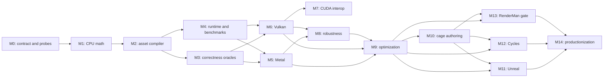

# Reimplementation Roadmap

## Purpose

This document turns the method in *Ray Tracing Massive Amounts of Animated Geometry* into an implementation program for:

- Metal ray tracing on Apple Silicon and macOS;
- Vulkan ray tracing on NVIDIA GPUs;
- optional CUDA/Vulkan interoperation;
- Unreal Engine 5;
- Cycles;
- RenderMan feasibility and integration.

Read [paper-analysis.md](paper-analysis.md) first. It contains the reconstructed mathematics, robustness variants, reported measurements, and the gaps that must be resolved experimentally.

This is a proof-gated roadmap. A milestone is complete only when its acceptance evidence exists. A small synthetic scene proves plumbing, not the paper's scale, animation quality, watertightness, or performance claims.

## 1. The implementation thesis

The method is most naturally implemented as a portable asset compiler plus a thin, backend-specific acceleration-structure runtime:

1. Offline, clip a dense source mesh into tetrahedra belonging to a coarse deforming cage.
2. Store each clipped micro-mesh in a canonical tetrahedral coordinate system.
3. Build one immutable bottom-level acceleration structure (BLAS) for each occupied tetrahedron of each base asset.
4. Each frame, deform only the cage, derive one affine transform per tetrahedron, and emit top-level instances that reference the immutable micro-BLAS objects.
5. Rebuild or update the top-level acceleration structure (TLAS), then trace the original dense geometry through the transformed micro-BLAS instances.

The fast path is portable in principle because Metal and Vulkan both expose instance transforms over reusable bottom-level acceleration structures. The difficult part is not the affine math. It is creating, updating, and traversing potentially millions of top-level instances within real driver and renderer constraints.

The exact watertight path should initially be treated as a reference implementation and research track. It replaces hardware triangle traversal with a custom 4D hierarchy and was 19-80 times slower to render in the paper. It is valuable as:

- a correctness oracle;
- an option for content where any crack is unacceptable;
- a test bed for tighter 4D bounds and hybrid traversal;
- a way to distinguish clipping and ownership bugs from floating-point transform cracks.

### Cross-platform concept map

| Paper/runtime concept | Metal standalone | Vulkan/NVIDIA standalone | Cycles | Unreal Engine | RenderMan |
| --- | --- | --- | --- | --- | --- |
| Immutable `muBLAS` | Triangle `MTLAccelerationStructure` | Triangle `VkAccelerationStructureKHR` BLAS | Metal BLAS or OptiX GAS | `FRayTracingGeometry`/RHI geometry if exposed at the needed granularity | No equivalent public hook confirmed; test retained procedural children |
| Per-tet transform | Metal 3x4 instance transform | `VkTransformMatrixKHR` | Metal instance or `OptixInstance`/motion transform | Scene `FRayTracingGeometryInstance` or custom RHI path | Riley/procedural transform if sufficiently granular |
| `tetLAS` | Instance acceleration structure | KHR TLAS | Metal IAS or OptiX IAS | Engine scene TLAS or separate diagnostic TLAS | Renderer-owned internal structure |
| GPU descriptor generation | Compute plus indirect instance descriptors | Vulkan compute writing instance records | Device-specific Cycles queue/kernel | RDG compute/RHI integration | Public feasibility unknown |
| Source hit provenance | Instance user ID plus tables | Instance custom index plus tables | Cycles primitive/shader mapping | Engine primitive/material mapping | Procedural/Riley primvar mapping |
| Exact 4D path | Bounding boxes plus intersection function or compute traversal | Procedural AABBs/intersection shader or compute traversal | Research-only device extension | Separate research pass before renderer integration | Requires a custom primitive/intersection hook not confirmed publicly |
| NVIDIA alternative | Not applicable | NV animated clusters and PTLAS experiments | OptiX native dynamic-geometry baseline | NVIDIA RHI extension/fork experiment | XPU internals are vendor-controlled |

The cells name the closest integration surface, not proof that it has the required scale or hierarchy behavior. M0, M11, and M13 exist specifically to turn those assumptions into verified facts.

## 2. Success criteria

The overall program succeeds only if all of the following are demonstrated.

### Correctness

- The rest pose reconstructs the source surface without missing regions, duplicate visible surfaces, or material/attribute discontinuities.
- Cage deformation produces the same position as applying the tetrahedron's barycentric interpolation to every generated micro-vertex.
- Normals use the inverse transpose of the full object-to-world linear transform.
- Mirrored, near-singular, and inverted tetrahedra follow a documented policy.
- Adjacent tetrahedra remain visually closed under the selected fast-path tolerance over a stress suite.
- The 4D path, if shipped, passes adversarial watertightness tests rather than only normal render comparisons.
- Hit records recover the original primitive, material, UVs, normals, and any renderer-specific payload.

### Performance

- Per-frame dense vertex deformation is eliminated on the tet-instancing path.
- Frame timing is reported as cage deformation, transform generation, instance generation, TLAS work, ray traversal, shading, synchronization, and total.
- The crossover against conventional deformation plus BLAS update/rebuild is measured over geometry count, ray count, deformation complexity, cage density, and instance count.
- Peak memory includes API object overhead, acceleration-structure storage, scratch, instance buffers, duplicated clipped geometry, provenance, and renderer integration overhead.
- Claims are reported separately for Metal and NVIDIA; one backend's result does not validate the other.

### Integration

- A renderer receives stable primitive/material attribution from a transformed micro-mesh hit.
- The implementation coexists with ordinary static, rigidly instanced, skinned, and procedural geometry.
- The scene hierarchy does not silently assume an unsupported third acceleration-structure level.
- Engine-specific work distinguishes a standalone proof, an editor/importer bridge, and actual participation in the engine's production ray-tracing pipelines.

## 3. Proposed repository architecture

```text
.
|-- CMakeLists.txt
|-- README.md
|-- docs/
|   |-- paper-analysis.md
|   |-- reimplementation-roadmap.md
|   `-- goal-prompts.md
|-- assets/
|   |-- cages/
|   `-- test-scenes/
|-- cmake/
|-- include/tetcage/
|   |-- asset_format.h
|   |-- barycentrics.h
|   |-- cage.h
|   |-- deformation.h
|   |-- provenance.h
|   `-- runtime.h
|-- src/
|   |-- compiler/
|   |-- core/
|   |-- cpu_reference/
|   |-- metal/
|   |-- vulkan/
|   `-- cuda_interop/
|-- shaders/
|   |-- common/
|   |-- metal/
|   `-- vulkan/
|-- integrations/
|   |-- unreal/
|   |-- cycles/
|   `-- renderman/
|-- tests/
|   |-- assets/
|   |-- correctness/
|   |-- differential/
|   `-- performance/
|-- tools/
|   |-- asset_compiler/
|   |-- cage_inspector/
|   `-- benchmark/
`-- results/
    |-- manifests/
    |-- metal/
    `-- nvidia/
```

Use C++20 for shared host-side code. Use Objective-C++ only at the Metal boundary. Keep the Vulkan runtime in ordinary C++ and add CUDA translation units only for the optional interop experiment.

Do not make an experimental shader cross-compiler a foundational dependency. A pragmatic first implementation uses:

- MSL for Metal ray tracing and compute;
- GLSL or Slang-to-SPIR-V for Vulkan;
- a small shared specification and generated conformance vectors for the barycentric and transform math.

Slang can later reduce duplication, but its current Metal ray-tracing support is still described as work in progress. The critical path should remain debuggable in native platform tools.

## 4. Canonical asset format

The canonical file must contain portable geometry and metadata, not serialized opaque Metal, Vulkan, or OptiX acceleration structures.

### Header and provenance

- magic, version, byte order, alignment, and feature flags;
- source asset and compiler version hashes;
- cage-generation settings and tolerance policy;
- source coordinate system, units, and handedness;
- checksums for independently loadable sections.

### Cage

- rest-pose cage vertex positions;
- tetrahedra as four globally stable vertex IDs;
- a deterministic local vertex order and its orientation;
- face adjacency and canonical face ownership;
- rest-pose inverse matrices or equivalent canonical transforms;
- cage skinning weights, animation binding, and optional keyframe samples;
- per-tetrahedron determinant and conditioning diagnostics.

### Micro-meshes

- occupied tetrahedron range table;
- canonical barycentric positions, preferably storing three values with the fourth reconstructed;
- triangle indices and per-triangle flags;
- per-generated-vertex provenance back to the source triangle and source barycentric coordinates;
- original primitive and material IDs;
- boundary classification and ownership metadata;
- optional quantized positions as an alternate stream, never the sole baseline representation.

### Optional research sections

- 4D BVH nodes and leaf ranges;
- cage LODs and mappings between levels;
- animation-quality residual statistics;
- precomputed visibility or clustering metadata;
- per-device acceleration-structure cache keys, stored separately from the canonical asset.

### Why hit provenance is mandatory

Clipping creates new vertices and splits one source triangle across several tetrahedra. A raw micro-triangle ID is therefore not enough for a production renderer. Each hit must reconstruct source-space interpolation so that:

- UV seams and material boundaries remain correct;
- normal, tangent, color, displacement, and custom attributes agree with the original asset;
- motion vectors can be derived consistently;
- duplicate boundary fragments can be assigned or rejected deterministically.

## 5. Portable runtime contract

The shared runtime should expose concepts rather than API objects:

```cpp
struct CagePose {
  Span<const float3> positions;
};

struct TetTransform {
  float3x4 object_from_canonical;
  float3x3 normal_from_canonical;
  uint32_t mesh_id;
  uint32_t tet_id;
  uint32_t flags;
};

struct FrameBuildInput {
  Span<const VisibleObject> objects;
  Span<const CagePose> poses;
  BuildPolicy policy;
};

struct TraceHit {
  uint32_t source_primitive;
  uint32_t material;
  float2 source_barycentrics;
  uint32_t object_id;
  uint32_t tet_id;
};
```

Backend adapters own:

- acceleration-structure allocation and lifetime;
- compacted immutable micro-BLAS objects;
- GPU-visible instance descriptors;
- TLAS build/update policy;
- scratch allocation, synchronization, and timing queries;
- ray-pipeline or ray-query integration;
- device capability checks and fallback selection.

The backend-independent code owns:

- cage deformation;
- affine transform derivation;
- determinant, conditioning, and orientation policy;
- visibility and LOD decisions;
- hit provenance interpretation;
- benchmark manifest and correctness reporting.

## 6. Backend implementation paths

### 6.1 Metal on macOS

#### Baseline

Use the classic Metal acceleration-structure APIs as the compatibility baseline:

1. Create one `MTLPrimitiveAccelerationStructureDescriptor` for each occupied micro-mesh.
2. Build with fast-intersection preference for static micro-BLAS objects.
3. Compact them where measurements show a worthwhile memory reduction.
4. Store their resource IDs or indices in a GPU-resident lookup.
5. Run a compute kernel that deforms cages and writes instance transforms plus metadata.
6. Build a two-level instance acceleration structure for the visible tetrahedra.
7. Trace with an intersection function only if custom hit filtering is needed; ordinary hardware triangles should remain the default fast path.

Use indirect instance descriptors when they materially reduce CPU work and are supported by the target feature set. Query ray-tracing support and all relevant limits at runtime. The standard Metal instance limit and the extended-limits mode differ by orders of magnitude, so extended limits are not an optional footnote for the paper's largest scenes.

#### Metal 4 optimization track

Evaluate, but do not assume:

- GPU-driven acceleration-structure command generation;
- build options that prefer fast intersection or minimize memory;
- indirect instance counts;
- extended limits;
- the exact acceleration-structure nesting depth supported on each target.

Apple's current documentation exposes richer Metal 4 construction controls, but the product baseline should be selected from measured device coverage. The runtime must fail clearly or choose a reduced-LOD/conventional fallback if the required instance capacity is absent.

#### Build versus refit

Benchmark both every-frame rebuild and refit/update. Refit is not automatically faster over long deformation sequences because tree quality can deteriorate. Use:

- rebuild after large motion or a quality threshold;
- refit for small coherent motion only when measured;
- double-buffered instance and acceleration-structure storage where it overlaps frames safely;
- a documented one-frame-latency mode as an optional throughput tradeoff.

#### Metal-specific risks

- millions of instances may exceed standard limits or be too costly even when legal;
- one API object per micro-BLAS may create significant driver overhead;
- engine renderers may already consume the only practical scene TLAS level;
- Metal feature availability differs across Apple GPU generations and OS releases;
- GPU capture and counter tooling must be integrated early because CPU timing alone hides command-encoding, build, and synchronization costs.

Primary references:

- [Apple: Ray tracing with acceleration structures](https://developer.apple.com/documentation/metal/ray-tracing-with-acceleration-structures)
- [Apple: Metal feature-set tables](https://developer.apple.com/metal/capabilities/)
- [Apple: Indirect instance acceleration-structure descriptor](https://developer.apple.com/documentation/metal/mtlindirectinstanceaccelerationstructuredescriptor)
- [Apple: Extended acceleration-structure limits](https://developer.apple.com/documentation/metal/mtlaccelerationstructureusage/extendedlimits)
- [Apple: Guide to Metal ray tracing](https://developer.apple.com/videos/play/wwdc2023/10128/)

### 6.2 Vulkan ray tracing on NVIDIA

#### Baseline

Use `VK_KHR_acceleration_structure` and `VK_KHR_ray_tracing_pipeline` or ray queries:

1. Build and compact one triangle BLAS per occupied micro-mesh.
2. Keep the BLAS device addresses stable for the lifetime of the asset cache.
3. Deform cages and generate `VkAccelerationStructureInstanceKHR` records in Vulkan compute.
4. Build or update the scene TLAS from the generated instance buffer.
5. Store object, mesh, tetrahedron, and provenance indices in instance custom indices and shader-visible tables.
6. Trace and reconstruct the original source attributes.

Query `VkPhysicalDeviceAccelerationStructurePropertiesKHR`, especially `maxInstanceCount`, scratch alignment, geometry limits, and update support. Follow Vulkan's explicit synchronization rules between compute writes, acceleration-structure builds, and ray traversal.

#### Why Vulkan compute comes before CUDA

The affine transform workload is small and maps directly to Vulkan compute. Keeping the baseline within one API:

- avoids external-memory and external-semaphore complexity;
- avoids device-identity and ownership mistakes;
- is portable beyond NVIDIA;
- gives a clean measurement of whether CUDA adds any value.

Only add CUDA if profiling identifies a concrete workload that benefits from an existing CUDA implementation or CUDA-specific primitive. Use external memory and semaphores, match devices by UUID, and avoid host round trips. The Vulkan-created buffers and synchronization contract remain authoritative.

#### NVIDIA extension experiments

`VK_NV_partitioned_acceleration_structure` can reduce update scope when only some partitions or translations change. It is unlikely to transform the base case where every visible tetrahedron deforms every frame. It becomes interesting when paired with:

- visibility culling;
- animation staggering;
- cage LOD;
- mostly rigid subgroups;
- a partitioned crowd where only a subset changes.

`VK_NV_cluster_acceleration_structure` is a serious alternative baseline, not a presumed add-on. NVIDIA's animated-cluster sample demonstrates fast rebuilds for repeated deforming topology and lower memory in its test. Compare it directly against:

- conventional skinned mesh plus BLAS update;
- tet instancing plus TLAS rebuild;
- animated clusters or templates.

The winning method may vary by asset. A production NVIDIA backend should be able to select per asset rather than forcing every mesh through the tetrahedral representation.

Primary references:

- [Vulkan acceleration-structure specification](https://docs.vulkan.org/spec/latest/chapters/accelstructures.html)
- [Vulkan acceleration-structure limits](https://docs.vulkan.org/refpages/latest/refpages/source/VkPhysicalDeviceAccelerationStructurePropertiesKHR.html)
- [NVIDIA partitioned TLAS proposal](https://docs.vulkan.org/features/latest/features/proposals/VK_NV_partitioned_acceleration_structure.html)
- [NVIDIA cluster acceleration-structure proposal](https://docs.vulkan.org/features/latest/features/proposals/VK_NV_cluster_acceleration_structure.html)
- [NVIDIA animated-cluster sample](https://github.com/nvpro-samples/vk_animated_clusters)
- [CUDA external resource interoperability](https://docs.nvidia.com/cuda/cuda-programming-guide/04-special-topics/graphics-interop.html)

### 6.3 OptiX as a Cycles-facing NVIDIA path

Cycles already has a mature OptiX backend. For Cycles integration, adding tet-instanced geometry to that backend is likely more natural than forcing the renderer through a new Vulkan device:

- build one OptiX GAS per occupied micro-mesh or a measured grouping;
- construct IAS instances from the per-frame tetrahedral transforms;
- propagate source primitive and material provenance through the shader binding table and hit data;
- preserve Cycles' existing CPU, CUDA, HIP, oneAPI, and Metal paths.

This is an integration-specific backend, not the portable NVIDIA proof. The standalone implementation should still validate the method under Vulkan first.

## 7. Robustness strategy

### 7.1 Fast path

Start with FP32 canonical coordinates and the paper's epsilon-grown clipping volume, then replace the single magic epsilon with a documented policy based on:

- asset scale and units;
- local tetrahedron edge lengths;
- transform condition number;
- floating-point ULP estimates;
- ray `t` range and renderer origin-offset policy.

Add deterministic ownership for generated boundary triangles. When a ray hits coincident fragments within a tolerance, select the owner by stable source primitive and cage-face rules. Do not use ownership filtering to conceal actual open cracks.

### 7.2 Degenerate and inverted cages

For each tetrahedron compute:

- signed determinant;
- condition estimate;
- minimum altitude or equivalent shape metric;
- orientation change relative to the rest pose.

Define thresholds and policies:

- healthy: normal fast path;
- poorly conditioned: conservative epsilon, rebuild, or alternate representation;
- near singular: conventional dense fallback, frozen last valid pose, or explicit invalid-frame result;
- inverted: update culling orientation or disable culling, while recording an animation-quality fault;
- self-intersecting cage: reject at authoring time unless a documented special case exists.

Never silently invert a nearly singular matrix.

### 7.3 Watertight reference path

Implement the paper's 4D barycentric BVH on CPU first. Preserve globally ordered cage vertex IDs and exact feature snapping. Differentially test it against:

- brute-force micro-triangle intersection;
- the fast hardware triangle path;
- random rays targeted at shared cage vertices, edges, and faces;
- animated near-degenerate configurations.

The paper projects a 4D node to 3D with a conservative min-sum bound. Test a tighter exact bound for each world-space coordinate:

```text
min/max sum_i b_i * p_i
subject to l_i <= b_i <= u_i and sum_i b_i = 1
```

Because there are only four barycentric dimensions and a linear objective, this bounded-simplex problem can be solved by filling the remaining weight in coefficient order. It is cheap enough to evaluate during node-bound construction and may materially improve traversal tightness. Verify conservativeness numerically and with interval stress tests before comparing speed.

### 7.4 Hybrid possibilities

After both paths exist, evaluate:

- hardware triangles for interior micro-triangles and custom handling only near cage boundaries;
- a small conservative boundary shell;
- ray replay only for ambiguous boundary hits;
- a coarse hardware TLAS over objects or cage clusters feeding a custom 4D traversal;
- higher precision only for transform generation and boundary classification.

These are experiments. Each must include an unbiased correctness comparison and total frame-time accounting.

## 8. Optimization opportunity map

### Offline compiler

- Canonicalize micro-vertices directly into the unit barycentric tetrahedron so runtime transforms do not multiply by the rest inverse.
- Use robust orientation predicates or exact arithmetic for topology decisions during clipping.
- Share boundary vertices by canonical cage feature IDs, not approximate position alone.
- Remove empty tetrahedra and compact all streams.
- Reorder micro-triangles for BLAS build and cache locality.
- Group only when measurements show that fewer BLAS objects outweigh lost per-tet transform granularity.
- Generate multiple cage LODs and preserve provenance across them.
- Record per-tet occupancy, boundary fraction, curvature, and deformation residual to drive later policy.

### Per-frame work

- Deform cage vertices once per distinct pose, not once per rendered copy.
- Generate transforms and instance descriptors entirely on the GPU.
- Fuse skinning, transform derivation, visibility, LOD, and descriptor compaction where it reduces bandwidth.
- Cull whole objects, cage regions, then tetrahedra before TLAS construction.
- Stagger animation or acceleration-structure updates for distant content.
- Separate rigid transforms from actual cage deformation; use ordinary instancing for rigid-only objects.
- Exploit identical poses across crowds by sharing the generated transform block when renderer semantics permit.

### Acceleration structures

- Compact static micro-BLAS objects.
- Batch build commands and pool scratch memory.
- Measure build-quality flags rather than selecting them by name.
- Choose rebuild, update, or periodic rebuild from measured traversal degradation.
- Investigate a forest of per-object TLAS structures only if the API and renderer truly support the required nesting; otherwise do not design around it.
- On NVIDIA, benchmark PTLAS and cluster AS against the baseline.

### Memory

- Store three canonical barycentric values and reconstruct the fourth.
- Evaluate 16-bit or block-quantized barycentrics with an FP32 correctness baseline.
- Compress provenance using per-micro-mesh base IDs and narrow local indices.
- Deduplicate identical base assets and identical micro-mesh streams.
- Stream BLAS objects and cage LODs by visibility.
- Report driver/API object overhead, not only buffer sizes.

### Cage quality

- Adapt cage density to curvature, silhouettes, material/displacement boundaries, and animation residual.
- Optimize cage skin weights over representative animation clips, as suggested by the paper.
- Add authoring diagnostics for per-triangle approximation error and tet conditioning.
- Fall back to conventional deformation for assets whose required cage is too dense.
- Consider hybrid assets: rigid parts, conventionally skinned sharp parts, and tet-cage dense smooth parts.

### Ray workload

- Select the method per pass. Shadow rays may benefit at a different crossover than path-tracing bounces or primary visibility.
- Use ray sorting or coherent traversal where the surrounding renderer supports it.
- Keep any-hit logic minimal and avoid provenance reconstruction until a committed closest hit when possible.
- Measure shader-binding and hit-record costs independently of traversal.

## 9. Benchmark and evidence design

### Baselines

Every backend must compare:

1. static dense mesh;
2. conventionally deformed dense mesh plus BLAS update;
3. conventionally deformed dense mesh plus BLAS rebuild;
4. tet instancing, fast hardware path;
5. tet instancing, 4D reference where feasible;
6. NVIDIA animated clusters when supported;
7. engine-native geometry path in integration milestones.

### Test matrix

Vary:

- dense triangles: 100K, 1M, 10M, 100M, and the largest feasible aggregate;
- cage tetrahedra per base asset;
- copies and total top-level instances;
- occupied versus empty tetrahedra;
- motion amplitude and conditioning;
- ray count, bounce count, and coherence;
- materials and alpha/any-hit usage;
- camera visibility and culling;
- build flags and rebuild/update policy;
- Metal GPU generation and NVIDIA architecture.

### Required scenes

- identity cube with analytically known coordinates;
- two tetrahedra sharing a face;
- vertex, edge, and face grazing-ray torture cases;
- mirrored and near-singular deformation;
- a dense smooth animated character or creature;
- grass/vegetation crowd comparable in shape to the paper's favorable case;
- rigid and low-detail counterexamples;
- topology-changing negative control;
- engine-native scene containing mixed geometry classes.

### Measurements

- median, p95, and variance after warm-up;
- GPU timestamps for every build and trace stage;
- CPU submission and synchronization time;
- peak and steady-state memory;
- acceleration-structure byte sizes and object counts;
- crack/miss/duplicate-hit counts from deterministic ray corpora;
- image error plus geometric positional/normal/attribute error;
- animation residual versus cage density;
- instance-limit and allocation failures.

Store:

- machine-readable JSON or CSV;
- device name, OS, driver, API, compiler, commit, build flags, scene hashes;
- scripts that reproduce every chart;
- captures for representative regressions;
- a written interpretation that distinguishes measurement from inference.

## 10. Milestones and exit gates

### M0 - Contract, scaffolding, and capability probes

Deliver:

- repository structure and build system;
- license and third-party attribution plan;
- paper-derived requirements matrix;
- Metal and Vulkan capability-report executables;
- benchmark result schema;
- explicit hardware matrix and fallback policy.

Exit gate:

- clean configure/build/test on the available macOS host and an identified NVIDIA environment;
- capability output records ray tracing, limits, extensions, and toolchain versions;
- no assumption about nested acceleration structures or instance capacity remains untested.

### M1 - CPU mathematics and geometry kernel

Deliver:

- tetrahedral barycentric conversion;
- canonical/world affine transforms;
- inverse-transpose normal transforms;
- determinant, condition, inversion, and mirror handling;
- robust segment/plane and polygon/tetrahedron clipping primitives;
- property and differential tests.

Exit gate:

- randomized tests reproduce vertexwise barycentric deformation within stated error;
- all permutation/orientation cases pass;
- degenerate cases return explicit policy outcomes rather than NaNs.

### M2 - Deterministic asset compiler

Deliver:

- cage construction or import;
- source-triangle clipping into tetrahedra;
- shared boundary vertex deduplication;
- source primitive/material/attribute provenance;
- canonical asset serialization and inspector;
- epsilon-expanded fast variant.

Exit gate:

- identity reconstruction passes topology and image tests;
- serialized assets are deterministic across repeated builds;
- every generated triangle maps back to a valid source triangle;
- no unowned or multiply owned cage boundary remains unexplained.

### M3 - CPU render and watertight oracles

Deliver:

- brute-force or CPU BVH renderer for compiled micro-meshes;
- 4D barycentric BVH reference;
- boundary-targeted ray generator;
- exact bounded-simplex projection experiment;
- crack, miss, and duplicate-hit report.

Exit gate:

- known adversarial cases pass the 4D watertight oracle;
- conservative bounds are mechanically verified;
- fast-path errors are quantified, not judged only by images.

### M4 - Runtime contract and benchmark harness

Deliver:

- backend-neutral runtime interfaces;
- asset cache and lifecycle;
- dense-deformation baselines;
- reproducible scene generator;
- JSON/CSV timing and memory output;
- image and hit differential tools.

Exit gate:

- one command runs the same scene definition against the CPU oracle and a placeholder backend;
- manifests capture enough information to reproduce a result;
- the harness separates all major frame stages.

### M5 - Metal fast path

Deliver:

- micro-BLAS build, compaction, and cache;
- GPU cage deformation and instance generation;
- TLAS build/update experiments;
- ray tracing and source-attribute reconstruction;
- extended-limit and unsupported-device handling;
- Metal capture and benchmark instructions.

Exit gate:

- correctness matches the CPU fast oracle over the suite;
- a dense animated asset runs without per-frame dense vertex updates;
- timings and full memory are recorded over a scale sweep;
- standard versus extended instance-limit behavior is proven on real devices.

### M6 - Vulkan fast path

Deliver:

- Vulkan micro-BLAS build, compaction, and cache;
- Vulkan compute transform/instance generation;
- synchronization-correct TLAS construction;
- ray pipeline or ray-query integration;
- NVIDIA profiling and benchmark instructions.

Exit gate:

- validation layers are clean for the test suite;
- correctness matches the CPU fast oracle;
- a scale sweep identifies the TLAS crossover and limits;
- no host readback exists on the per-frame critical path.

### M7 - CUDA/Vulkan interop experiment

Deliver:

- a written hypothesis for why CUDA should outperform Vulkan compute;
- UUID-matched external memory and semaphore bridge;
- equivalent CUDA and Vulkan compute kernels;
- end-to-end timing including synchronization;
- retain/remove decision.

Exit gate:

- keep CUDA only if it provides a material measured benefit or required ecosystem integration;
- otherwise preserve Vulkan compute as the sole production path and document the negative result.

### M8 - GPU robustness and optional watertight path

Deliver:

- scale- and conditioning-aware fast tolerance;
- deterministic boundary ownership;
- GPU adversarial test suite;
- GPU 4D traversal prototype on at least one backend;
- hybrid traversal experiments.

Exit gate:

- fast-path residual failure rate is bounded over a declared domain;
- exact path passes the watertight corpus;
- performance and memory costs are reported without hiding behind reduced ray counts.

### M9 - Scale, optimization, and method selection

Deliver:

- full backend benchmark matrix;
- adaptive rebuild/update policy;
- culling, LOD, staggering, batching, and memory experiments;
- NVIDIA PTLAS/cluster comparison when available;
- per-asset method-selection model;
- optimization report with rejected experiments.

Exit gate:

- measured crossover surfaces exist for both platforms;
- the paper's qualitative advantages are independently reproduced or explicitly not reproduced;
- one aggregate scene reaches a meaningful massive-geometry scale without invalidating frame or memory accounting.

### M10 - Cage quality and authoring

Deliver:

- cage import/generation workflow;
- deformation residual and conditioning visualization;
- adaptive cage refinement;
- cage skin-weight optimization over animation clips;
- cage LOD generation;
- conventional/hybrid fallback recommendation.

Exit gate:

- representative production-style animation meets declared position, normal, silhouette, and shading tolerances;
- authoring tools identify assets for which the method is unsuitable;
- quality is demonstrated across a clip, not one pose.

### M11 - Unreal Engine integration

Deliver in stages:

1. asset importer and editor visualization;
2. standalone Render Dependency Graph pass that builds/traces the tet geometry and composites a diagnostic result;
3. mixed-scene hit/material bridge;
4. engine-source integration plan for hardware ray tracing, path tracer, and Lumen participation;
5. Windows/NVIDIA proof, with macOS/Metal scoped to what the selected UE version actually exposes.

Exit gate:

- the prototype is explicit about whether it uses the engine scene TLAS or a separate diagnostic TLAS;
- source primitive/material attribution works in an engine material;
- the million-instance impact is measured against UE's native scene update;
- full Lumen/path-tracer support is not claimed until those pipelines actually trace the representation.

### M12 - Cycles integration

Deliver:

- canonical asset loader or Blender import path;
- MetalRT integration in the Cycles Metal device;
- OptiX IAS/GAS integration for NVIDIA;
- Cycles kernel hit provenance and attribute reconstruction;
- mixed geometry, motion blur, and material tests;
- Blender UI/authoring proposal.

Exit gate:

- the same `.blend` test scene renders through Metal and OptiX with comparable semantics;
- ordinary Cycles devices remain functional;
- image differences are explained by numeric policy, not missing attributes;
- performance includes Cycles shading and scheduling, not only standalone traversal.

### M13 - RenderMan feasibility gate

Deliver:

- public API capability matrix for Riley, procedurals, RIS, and XPU;
- procedural prototype that consumes a tet-cage asset;
- explicit determination of whether public APIs permit custom acceleration structures or intersection;
- Pixar partnership/internal-hook requirements if they do not;
- fallback value proposition if the public path must emit ordinary geometry.

Exit gate:

- proceed to a true renderer integration only if the required hook is available;
- otherwise stop at a validated asset/deformation procedural and document that it does not preserve the paper's acceleration-structure advantage.

### M14 - Productionization and release

Deliver:

- stable file format and migration tests;
- fuzzing and malformed-asset handling;
- deterministic asset builds;
- shader and CPU conformance suite;
- CI matrix;
- licensing and attribution review;
- reproducible paper-style report;
- sample assets and end-user documentation.

Exit gate:

- a clean checkout can reproduce declared correctness and performance results on supported hardware;
- unsupported configurations fail safely;
- every headline claim links to a result manifest and command.

## 11. Dependency graph



Metal and Vulkan can proceed in parallel after the shared compiler, oracle, and benchmark contracts are stable. Engine integrations should wait for M9: otherwise renderer work risks embedding an unmeasured representation whose instance count or memory model is already nonviable.

## 12. Engine and renderer integration analysis

### 12.1 Unreal Engine 5

UE is the most demanding integration because its renderer already owns scene geometry, ray-tracing geometry, scene instances, shader tables, visibility, and multiple consumers.

#### Recommended entry sequence

1. **Editor asset plugin:** import the canonical asset, display the cage and micro-mesh diagnostics, validate animation binding.
2. **Standalone render pass:** create a separate acceleration structure in an RDG pass, trace a diagnostic output, and prove lifetime/synchronization.
3. **Material bridge:** map a hit back to engine primitive/material data and shade a constrained material.
4. **Scene integration:** add a new geometry representation or dynamic ray-tracing provider in an engine-source fork.
5. **Pipeline consumers:** explicitly integrate the path tracer, hardware-ray-traced effects, and then investigate Lumen hardware RT.

#### Central hierarchy problem

The paper describes a per-object tetLAS and then a final scene containing copies, but commodity APIs are normally discussed as BLAS plus TLAS. UE already uses its scene TLAS. Unless the selected RHI/backend proves a supported extra level, every visible tetrahedron must effectively be an engine scene instance. That affects:

- instance capacity;
- UE scene-update CPU and GPU costs;
- shader table size and binding;
- culling and visibility semantics;
- per-primitive metadata;
- coexistence with Nanite and ordinary dynamic geometry.

Epic's current hardware ray-tracing documentation warns that scene update costs can become significant above 100,000 instances. This method can require millions, so a plugin that only imports geometry is not enough. The feasibility prototype must measure real UE TLAS and renderer overhead before a full integration is approved.

#### Nanite and rasterization

Do not conflate this method with Nanite. The tet representation can be ray-tracing-only while rasterization continues through Nanite or ordinary meshes, but then:

- raster and ray representations must share animation and material state;
- visibility and LOD choices must not diverge visibly;
- memory includes both representations;
- motion vectors and temporal effects need consistent previous poses.

Primary references:

- [Epic: Hardware Ray Tracing in Unreal Engine](https://dev.epicgames.com/documentation/en-us/unreal-engine/hardware-ray-tracing-in-unreal-engine)
- [Epic: Ray Tracing Performance Guide](https://dev.epicgames.com/documentation/unreal-engine/ray-tracing-performance-guide-in-unreal-engine)
- [Epic: FRayTracingGeometry API](https://dev.epicgames.com/documentation/unreal-engine/API/Runtime/RenderCore/FRayTracingGeometry)
- [Epic: FRayTracingSceneInitializer API](https://dev.epicgames.com/documentation/unreal-engine/API/Runtime/RHI/FRayTracingSceneInitializer)

### 12.2 Cycles

Cycles is a better research integration target because it is open source and already has separate MetalRT and OptiX acceleration-structure implementations.

#### Metal path

Extend the Metal device's BVH/acceleration-structure layer to:

- recognize a tet-cage geometry asset;
- cache compacted micro-BLAS objects;
- generate motion or static instances from cage poses;
- attach resource tables for source provenance;
- choose ordinary Cycles geometry for unsupported or unsuitable assets.

#### NVIDIA path

Extend the OptiX device rather than adding Vulkan to Cycles:

- GAS per micro-mesh or measured grouping;
- IAS instances per visible tetrahedron;
- SBT/hit payload mapping to original Cycles primitives and shaders;
- motion transform support where it exactly matches the cage interpolation model.

An affine tet transform is linear in its four cage vertices. If the cage vertices interpolate linearly between time samples, linearly interpolating the affine matrix reproduces that vertexwise interpolation. Validate the API's motion-transform semantics before relying on this for motion blur.

#### Kernel and attributes

Cycles kernel code runs across multiple backends, so isolate the new hit representation behind a small shared abstraction. Reconstruct original source barycentrics before the standard attribute fetch path whenever possible. Avoid spreading tet-specific conditionals across every shader.

Primary references:

- [Cycles standalone repository](https://github.com/blender/cycles)
- [Cycles Metal acceleration-structure implementation](https://github.com/blender/cycles/blob/main/src/device/metal/bvh.mm)
- [Cycles kernel language and backend constraints](https://developer.blender.org/docs/features/cycles/kernel_language/)

### 12.3 RenderMan

RenderMan should begin with a capability and partnership gate, not a promise of equivalent integration.

The public Riley and procedural APIs can create and update scene geometry. That is sufficient to:

- load the canonical asset;
- deform cages;
- visualize or expand selected micro-meshes;
- validate materials and motion in RIS;
- build an authoring bridge.

It does not necessarily expose the renderer's internal BLAS/TLAS construction or a custom XPU intersection primitive. If the procedural expands dense triangles each frame, the asset works but the central performance benefit has been lost.

The feasibility study must answer:

- Can a public procedural retain immutable child geometry and update only transforms at the necessary granularity?
- Can RIS and XPU both consume it?
- Is the resulting instance count supported and efficiently represented?
- Can a plugin supply a custom primitive intersection or acceleration structure?
- Is source access or a Pixar engineering partnership required?

RenderMan 27's public positioning describes XPU as the production GPU path and NVIDIA/CUDA-focused, while macOS support differs between RIS and XPU. Treat Metal RenderMan support as vendor-roadmap-dependent, not part of the standalone Metal implementation.

Primary references:

- [Pixar: RenderMan 27 release](https://renderman.pixar.com/news/pixar-animation-studios-releases-renderman-27)
- [Pixar: RenderMan general FAQ](https://renderman.pixar.com/general-faq)
- [Pixar: RenderMan 27 API reference](https://renderman.pixar.com/resources/rman27/index.html)
- [Pixar: Riley scene API](https://renderman.pixar.com/resources/rman27/classRiley.html)

## 13. Principal risks and decision gates

| Risk | Why it matters | Early proof | Stop or pivot condition |
|---|---|---|---|
| TLAS instance scaling | The paper's aggregate may require millions of instances | M0 limits, M5/M6 scale sweeps | Build/update dominates beyond useful crossover |
| AS hierarchy mismatch | Engines already own a two-level scene hierarchy | M0 feature probe, M11 separate versus scene TLAS | No supported nesting and flattened instance cost is nonviable |
| Clipping expansion | Geometry and provenance can exceed source memory | M2 reports per asset | Expansion plus BLAS overhead erases benefit |
| Cage approximation | Dense visual detail may not follow a coarse cage | M10 clip-wide residual study | Required cage density approaches dense deformation cost |
| Cracks/duplicates | Independent transforms perturb shared boundaries | M3/M8 adversarial rays | Fast path cannot meet declared visual/error domain |
| Degenerate animation | Tet matrices can become ill-conditioned or invert | M1/M10 diagnostics | Production animation frequently needs fallback |
| Engine material semantics | Split triangles must shade as originals | M2 provenance, M11/M12 material tests | Missing attributes or SBT explosion is not repairable |
| Vendor feature dependence | Extended limits and NV extensions reduce portability | M0 capability matrix | Required feature lacks target coverage |
| RenderMan API access | Public API may not expose custom AS/intersection | M13 capability gate | Stop at procedural bridge; seek vendor partnership |
| No public reference code | Reimplementation starts from paper equations and tests | M1-M3 oracles | Ambiguity cannot be resolved by independent derivation |

## 14. Recommended delivery slices

### Slice A - Scientific reproduction

M0-M4 plus a small Metal and Vulkan proof. Outcome: a trustworthy compiler, CPU oracle, and equivalent image on both APIs.

### Slice B - Performance reproduction

M5-M9. Outcome: independent crossover surfaces, a retained or rejected CUDA path, and an evidence-backed optimization policy.

### Slice C - Production content

M10. Outcome: authoring and automatic suitability diagnostics on real animation.

### Slice D - Renderer integrations

M11-M13. Outcome: UE and Cycles working integrations, plus a fact-based RenderMan decision.

### Slice E - Release

M14. Outcome: stable assets, CI, documentation, reproducible reports, and supported-device policy.

## 15. Rough effort and team shape

These are engineering planning bands, not delivery commitments. They assume access to appropriate Apple and NVIDIA hardware, an experienced graphics programmer, and no long vendor-access delay.

| Milestone | Rough focused effort | Primary roles |
| --- | ---: | --- |
| M0 | 1-2 engineer-weeks | build/platform |
| M1 | 2-4 engineer-weeks | geometry/numerics |
| M2 | 4-8 engineer-weeks | geometry/assets |
| M3 | 3-6 engineer-weeks | ray tracing/numerics |
| M4 | 2-4 engineer-weeks | systems/performance |
| M5 | 4-8 engineer-weeks | Metal |
| M6 | 4-8 engineer-weeks | Vulkan/NVIDIA |
| M7 | 1-3 engineer-weeks | CUDA/Vulkan |
| M8 | 4-8 engineer-weeks | ray tracing/numerics |
| M9 | 4-8 engineer-weeks | performance |
| M10 | 6-12 engineer-weeks | geometry/tools/animation |
| M11 | 8-16 engineer-weeks | Unreal/RHI |
| M12 | 8-16 engineer-weeks | Cycles/Metal/OptiX |
| M13 | 2-6 engineer-weeks plus vendor response time | RenderMan |
| M14 | 4-8 engineer-weeks | release/QA |

A practical core team is three to five people:

- one geometry/numerics and offline-asset engineer;
- one Metal engineer;
- one Vulkan/NVIDIA engineer;
- one renderer-integration engineer, added after M9;
- shared performance/QA responsibility, or a dedicated specialist at scale.

With Metal and Vulkan parallelized after M4, a scientific proof through M6 is plausibly a two-to-four-month program for that team. Robust scale reproduction and production content are another two-to-four months. UE and Cycles should be budgeted as separate integration projects after the standalone method earns its place. RenderMan schedule depends more on the public/private API decision than on the procedural prototype itself.

The milestone prompts in [goal-prompts.md](goal-prompts.md) are designed to drive these slices without quietly weakening the exit gates.
